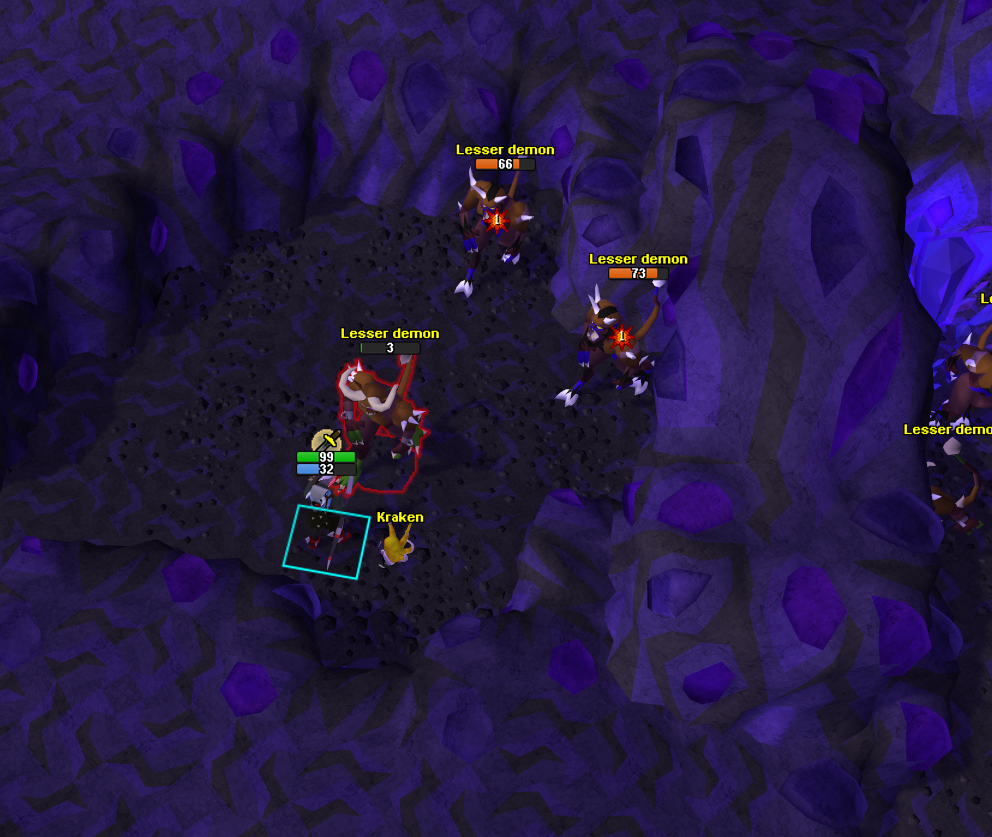
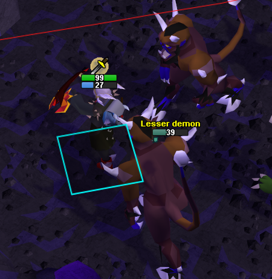

# Custom HP Bar

A RuneLite plugin that replaces the native health bar with a fully custom overlay - HP numbers
drawn directly on the bar, independent styling for NPCs vs. players, precise (not bucketed) HP
tracking, and status-effect debuffs.

  
  

## Features

- **Custom-drawn HP bars** — replaces the native health bar for NPCs and players, each with its
  own fully independent size, shape, color, and font settings.
- **Precise NPC HP** — tracks exact current HP for ~4,000 NPCs from a bundled dataset, not the
  native bar's coarse ratio/scale bucket, self-correcting if it ever drifts. Falls back to a
  percentage for NPCs not in the dataset.
- **Status effect tinting and icons** — the bar changes color and shows a debuff icon while
  poisoned, envenomed, burning, diseased, or corrupted - on NPCs, yourself, and other players
  alike. Bleed additionally tints your own bar. Colors and icons are sourced from the actual
  hitsplat sprites, not guessed, and aren't user-configurable. Multiple effects at once show
  side by side.
- **NPC names** — shown above the bar, optionally at all times rather than only in combat, with
  non-attackable NPCs (bankers, shop owners, fishing spots, pets) excluded by default.
- **Prayer bar** — an optional second bar below your HP bar showing current Prayer points.
- **Hide the native health bar** — replaces the game's own overhead bar client-wide (sprite-level
  override) so only this plugin's bar shows.
- **Zoom scaling** — bars and text grow/shrink with camera zoom to match the actor model.
- **Independent persist duration** — NPCs and players each keep showing their last known HP for
  their own configurable duration after combat ends.
- **NPC filter** — hide specific NPCs by name, wildcards supported.

## Configuration

Settings are grouped into four sections. Bar/text styling and status effect options are
configured **separately for the Target Bar (NPCs) and Player Bar (You & Others)** - every
setting in the table below exists twice, once per section, so NPCs and players can look
completely different if you want. Defaults are the same for both unless noted.

### Shared style options (Target Bar and Player Bar, configured independently)

| Setting | Description | Default |
|---|---|---|
| Bar Width | Width of the bar in pixels | 50 |
| Bar Height | Height of the bar in pixels | 10 |
| Corner Radius | Rounds the corners of the bar. 0 = sharp corners, matching the native health bar. | 2 |
| Border Width | Thickness of the bar's outline in pixels. 0 = no border. | 1 |
| Border Color | Color of the bar's outline | Black (translucent) |
| Bar Color | Fill color of the bar, matching the native health bar's single green fill | Green |
| Background Color | Color of the empty portion of the bar | Dark gray (translucent) |
| Vertical Offset | Pixels to shift the bar up (positive) or down (negative) from center | Target: 5 · Player: 15 |
| Font | Typeface for the HP text - RuneScape options use the game's own UI font | System Default |
| Font Style | Applied on top of the chosen font. Leave Plain for "RuneScape Bold" - it's already bold. | Bold |
| Font Size | Size of the HP number text | 11 |
| Text Color | Color of the HP number | White |
| Text Outline | Full outline around the text for readability at small sizes | On |
| Text Vertical Nudge | Nudges the HP text down (positive) or up (negative) if it looks off-center | 0 |
| Color By Status Effect | Tints the bar while poisoned, envenomed, burning, diseased, or corrupted (the Player Bar version also covers bleeding, and applies to other players' bars too) | On |
| Show Status Icon | Shows a debuff icon beneath the bar for the same effects (Player Bar version also applies to other players' bars) | On |
| Persist Duration (seconds) | How long a bar keeps showing the last known HP after the native bar fades. 0 = hide immediately. | 5 |

### Target Bar (NPCs) only

| Setting | Description | Default |
|---|---|---|
| Display Mode | Show HP as a raw number, a percentage, or both. Falls back to percent for NPCs with unknown max HP. | Number |
| Show NPC Name | Draws the NPC's name above its HP bar | On |
| Always Show NPC Name | Shows the NPC name at all times, not just in combat. Requires Show NPC Name. | On |
| Only Show Combat NPC Names | Excludes non-attackable NPCs (bankers, shop owners, fishing spots, pets) from bars and names | On |
| NPC Name Color | Color of the NPC name text, independent of Text Color above | Yellow |

### Player Bar (You & Others) only

| Setting | Description | Default |
|---|---|---|
| Show for Self | Draw the player bar over your own character | On |
| Self Display Mode | Display mode for your own bar | Number |
| Show for Other Players | Draw the player bar over other players | Off |
| Other Players' Display Mode | Display mode for other players' bars (always percent - their max HP isn't available) | Number |
| Show Prayer Bar | Draws a second bar for your Prayer points beneath your HP bar. Requires Show for Self. | On |

### Behavior

| Setting | Description | Default |
|---|---|---|
| Scale With Zoom | Grow/shrink bars and text with camera zoom. Sizes above are exact at the zoom level you're at when the plugin starts, and scale relative to that as you zoom in/out. | Off |
| Hide Native Health Bar | Hides the game's built-in health bar for every actor, not just filtered NPCs | On |

### NPC Filter

| Setting | Description | Default |
|---|---|---|
| NPC Filter | Comma-separated NPC names to hide (blacklist, supports `skele*` wildcards). Leave blank to show all. | (blank) |
