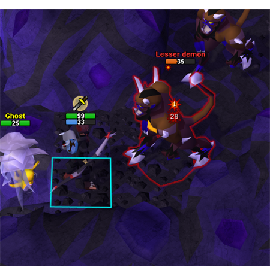
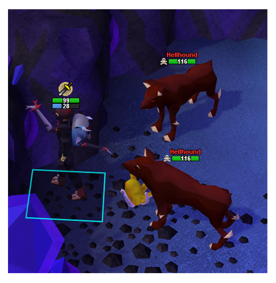
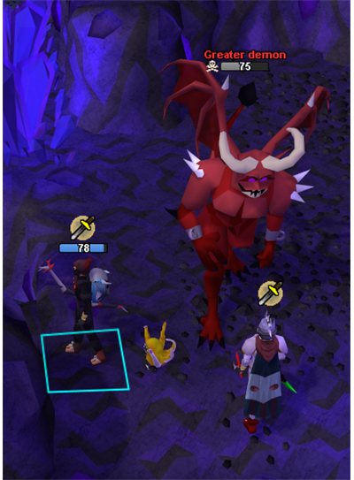
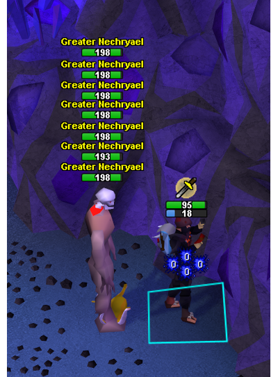

# Custom HP Bar

A RuneLite plugin that replaces the native health bar with a fully custom overlay - HP numbers
drawn directly on the bar, independent styling for NPCs vs. players, precise (not bucketed) HP
tracking, and status-effect debuffs.

> **Note:** PvP remains largely untested for now.

  
  

  
  

## Features

- **Custom-drawn HP bars** — replaces the native health bar for NPCs and players, each with fully
  independent size, shape, color, and font settings.
- **Precise NPC HP** — tracks exact current HP instead of the native bar's coarse ratio bucket,
  falling back to a percentage where max HP isn't known.
- **Status effect tinting and icons** — tints the bar and shows a debuff icon for poison, venom,
  burn, disease, and corruption. Multiple effects show side by side.
- **NPC names** — drawn above the bar, optionally at all times rather than only in combat.
  Non-attackable NPCs are excluded by default.
- **Same-tile stacking** — actors sharing a tile get their bars and names stacked vertically
  instead of overlapping.
- **Always show NPC bars** — optionally show the bar on every attackable NPC, not just once you
  engage it.
- **Aggressive NPC indicator** — optionally color a known-aggressive monster's name and show an
  icon by its bar, reverting once the game's tolerance timer expires.
- **Ironman shared-loot warning** — optionally grey out an NPC's bar once another player damages
  it. Bosses with shared or personal loot are exempt.
- **Prayer bar** — an optional Prayer points bar below your HP bar, or on its own outside combat.
  Can be limited to while a prayer is active; flicking keeps it up.
- **Food heal preview** — hovering food or a potion extends your bar with a preview of where HP
  would land.
- **Prayer restore preview** — the same for your Prayer bar, when hovering a Prayer-restoring item.
- **Replaced overhead icon** — optionally redraws your overhead prayer icon, hitsplats, and chat
  text above your HP bar.
- **Hide the native health bar** — replaces the game's own overhead bar client-wide, so only this
  plugin's bar shows.
- **Zoom scaling** — bars and text grow and shrink with camera zoom.
- **Independent persist duration** — NPCs and players each keep showing their last known HP for
  their own configurable duration after combat.
- **NPC filter** — hide specific NPCs by name, wildcards supported.

## Configuration

Settings are grouped into four sections. Bar/text styling and status effect options are
configured **separately for the Target Bar (NPCs) and Player Bar (You & Others)** - every
setting in the table below exists twice, once per section, so NPCs and players can look
completely different if you want. Defaults are the same for both unless noted.

### Shared style options (Target Bar and Player Bar, configured independently)

| Setting | Description | Default |
|---|---|---|
| Bar Width | Width of the bar in pixels | 50 |
| Bar Height | Height of the bar in pixels | 10 |
| Corner Radius | Rounds the corners of the bar. 0 = sharp corners. | 2 |
| Border Width | Thickness of the bar's outline in pixels. 0 = no border. | 1 |
| Border Color | Color of the bar's outline | Black (translucent) |
| Bar Color | Fill color of the bar | Green |
| Background Color | Color of the empty portion of the bar | Dark gray (translucent) |
| Vertical Offset | Pixels to shift the bar up (positive) or down (negative) from center | Target: 5 · Player: 15 |
| Font | Typeface for the HP text | System Default |
| Font Style | Applied on top of the chosen font | Bold |
| Font Size | Size of the HP number text | 11 |
| Text Color | Color of the HP number | White |
| Text Outline | Full outline around the text for readability at small sizes | On |
| Text Vertical Nudge | Nudges the HP text down (positive) or up (negative) if it looks off-center | 0 |
| Color By Status Effect | Tints the bar while poisoned, envenomed, burning, diseased, or corrupted. The Player Bar version also covers bleeding. | On |
| Show Status Icon | Shows a debuff icon beneath the bar for the same effects | On |
| Persist Duration (seconds) | How long a bar keeps showing the last known HP after the native bar fades. 0 = hide immediately. | 5 |

### Target Bar (NPCs) only

| Setting | Description | Default |
|---|---|---|
| Display Mode | Show HP as a raw number, a percentage, or both. | Number |
| Show NPC Name | Draws the NPC's name above its HP bar | On |
| Always Show NPC Name | Shows the NPC name at all times, not just in combat. Requires Show NPC Name. | On |
| Always Show NPC Bar | Shows the HP bar on every attackable NPC, not just once engaged. | Off |
| Only Show Combat NPC Names | Excludes non-attackable NPCs from bars and names | On |
| NPC Name Color | Color of the NPC name text, separate from the HP number's color | Yellow |
| Color Aggressive NPC Names | Colors an NPC's name while it's aggressive toward you, reverting once the tolerance timer expires. | Off |
| Aggressive NPC Name Color | Name color while an NPC is aggressive. Requires Color Aggressive NPC Names. | Red |
| Show Aggressive NPC Icon | Shows an icon next to the bar while an NPC is aggressive | Off |
| Grey Out Health Bars | Greys out an NPC's bar once another player damages it, so an Ironman can tell the kill isn't exclusively theirs. Ironman accounts only; bosses with shared or personal loot are exempt. | On |

### Player Bar (You & Others) only

| Setting | Description | Default |
|---|---|---|
| Show for Self | Draw the player bar over your own character | On |
| Self Display Mode | Display mode for your own bar | Number |
| Show for Other Players | Draw the player bar over other players | Off |
| Other Players' Display Mode | Display mode for other players' bars. Requires Show for Other Players. | Number |
| Show Prayer Bar | Draws a Prayer points bar beneath your HP bar, or on its own outside combat. Requires Show for Self. | On |
| Hide Prayer Bar While Not Praying | Only draws the Prayer bar while a prayer is active. Flicking keeps it up. Requires Show Prayer Bar. | Off |
| Show Food Heal Preview | Previews HP restored by a hovered food/potion as an extra bar segment. Requires Show for Self. | On |
| Show Prayer Restore Preview | Previews Prayer points restored by a hovered item as an extra bar segment. Requires Show Prayer Bar. | On |
| Replace Overhead Icon | Replaces your native overhead icon, hitsplats, and chat text with a redrawn copy positioned above your HP bar. Requires Show for Self. | On |

### Behavior

| Setting | Description | Default |
|---|---|---|
| Scale With Zoom | Grows and shrinks bars and text with camera zoom. | Off |
| Hide Native Health Bar | Hides the game's built-in health bar for every actor, not just filtered NPCs | On |

### NPC Filter

| Setting | Description | Default |
|---|---|---|
| NPC Filter | Comma-separated NPC names to hide. Supports `*` wildcards; leave blank to show all. | (blank) |
