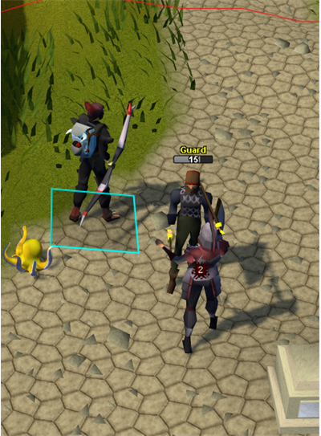

# Custom HP Bar

A RuneLite plugin that replaces the native health bar with a fully custom overlay - HP numbers
drawn directly on the bar, independent styling for NPCs vs. players, precise HP
tracking, and status-effect debuffs.

> **Note:** PvP remains largely untested for now.

  
  

  
  
  

## Features

- **Custom-drawn HP bars** — replaces the native health bar for NPCs and players, each with fully
  independent size, shape, color, and font settings. Your own bar can persist outside combat
  instead of only showing while tracked.
- **Precise NPC HP** — tracks exact current HP instead of the native bar's coarse ratio bucket,
  falling back to a percentage where max HP isn't known.
- **HP color gradient** — optionally blend the bar from full-HP color through a mid color at a
  configurable midpoint to a low color at empty, per bar type.
- **Bar opacity** — an optional transparency slider for the bar's background, fill, and border,
  configurable separately per bar type.
- **Status effect tinting and icons** — tints the bar and shows a debuff icon for poison, venom,
  burn, disease, and corruption. Multiple effects show side by side.
- **NPC names** — drawn above the bar, optionally at all times rather than only in combat, and
  optionally with the NPC's combat level. Long names can be truncated to a character limit.
  Non-attackable NPCs are excluded by default.
- **Other players' names** — optionally drawn above their bar, at all times or only while it's
  tracked. Requires Show for Other Players.
- **Always show other players' HP bars** — optionally show the bar on every visible player, not
  just once tracked in combat.
- **Same-tile stacking** — actors sharing a tile get their bars and names stacked vertically
  instead of overlapping.
- **Always show NPC bars** — optionally show the bar on every attackable NPC, not just once you
  engage it.
- **Aggressive NPC indicator** — optionally color a known-aggressive monster's name and bar and
  show an icon by its bar, reverting once the game's tolerance timer expires.
- **Ironman shared-loot warning** — optionally grey out an NPC's bar, its name, or both once another
  player damages it. Bosses with shared or personal loot are exempt.
- **Prayer bar** — an optional Prayer points bar below your HP bar, or on its own outside combat.
  Can persist outside combat, be limited to while a prayer is active (flicking keeps it up), and
  show a per-tick flick-timing indicator that sweeps across it. Color configurable.
- **Special attack bar** — an optional special attack energy bar, shown in combat alongside your HP
  bar, or persistently outside combat. Color configurable.
- **Run energy bar** — an optional run energy bar, shown regardless of combat state. Switches to a
  distinct color while a Stamina potion's drain-reduction effect is active, can time out after a
  configurable period of not running, or always stay up regardless of that timeout.
- **Bar order** — four independent pickers choose which bar (HP, Prayer, Special Attack, or Run
  Energy) goes in each of the four stack positions.
- **Restore previews** — hovering a food/potion, Prayer-restoring item, or Stamina potion extends
  the matching HP, Prayer, or Run Energy bar with a preview of where it'll land.
- **Replaced overhead icon** — redraws your overhead prayer icon, hitsplats, and chat text above
  your HP bar.
- **Hide the native health bar** — replaces the game's own overhead bar client-wide, so only this
  plugin's bar shows.
- **Zoom scaling** — bars and text grow and shrink with camera zoom.
- **Independent persist duration** — NPCs and players each keep showing their last known HP for
  their own configurable duration after combat.
- **NPC filter** — hide specific NPCs by name, wildcards supported.

## Configuration

Settings are grouped into five sections. Each bar type gets a **Style** section (size, shape, color,
text) and an **Info** section (what is shown and when), plus a shared **Behavior** section:

- Target Bar — Style
- Target Bar — NPC Info
- Player Bar — Style
- Player Bar — Player Info
- Behavior

Styling is configured **separately for the target bar (NPCs) and the player bar (you & others)** -
every setting in the first table below exists twice, once per Style section, so NPCs and players
can look completely different if you want. Defaults are the same for both unless noted.

### Style options (present in both Style sections)

| Setting | Description | Default |
|---|---|---|
| Bar Width | Width of the bar in pixels | 50 |
| Bar Height | Height of the bar in pixels | 10 |
| Corner Radius | Rounds the corners of the bar. 0 = sharp corners. | 2 |
| Border Width | Thickness of the bar's outline in pixels. 0 = no border. | 1 |
| Border Color | Color of the bar's outline | Black (translucent) |
| Bar Color | Fill color of the bar, and the full-HP color when HP Color Gradient is on. | Green |
| HP Color Gradient | Blends the bar's fill color as HP drops. Off keeps Bar Color at all HP levels. | Off |
| Mid HP Color | Color reached at the midpoint, blended toward from both sides. Requires HP Color Gradient. | Yellow |
| Midpoint | HP percentage at which the bar is exactly Mid HP Color. Target allows 0-100, player 1-99. | 50 |
| Low HP Color | Color reached at 0% HP. Requires HP Color Gradient. | Red |
| Background Color | Color of the empty portion of the bar | Dark gray (translucent) |
| Vertical Offset | Pixels to shift the bar up (positive) or down (negative) from center | Target: 5 · Player: 15 |
| Font | Typeface for the HP text | System Default |
| Font Style | Applied on top of the chosen font | Bold |
| Font Size | Size of the HP number text | 11 |
| Text Color | Color of the HP number | White |
| Text Outline | Full outline around the text for readability at small sizes | On |
| Text Vertical Nudge | Nudges the HP text down (positive) or up (negative) if it looks off-center | 0 |
| Text Alignment | Where the bar's text sits horizontally within it. On the player bar, applies to all stacked bars (HP, Prayer, Special, Run). | Center |
| HP Text Spacing | Pushes the HP number and percentage apart, up to the width of the bar. Requires a Display Mode of Both. | 0 |
| Bar Opacity | Overall transparency of the bar's background, fill, and border. 100 = fully opaque; the HP text itself is unaffected. Player bar also covers the Prayer, Special Attack, and Run Energy bars. | 100 |

### Target Bar — Style (in addition to the above)

| Setting | Description | Default |
|---|---|---|
| Display Mode | Show HP as a raw number, a percentage, or both. | Number |

### Target Bar — NPC Info

| Setting | Description | Default |
|---|---|---|
| Show NPC Name | Draws the NPC's name above its HP bar | On |
| Always Show NPC Name | Shows the NPC name at all times, not just in combat. Requires Show NPC Name. | On |
| Show Combat Level | Appends the NPC's combat level to its name. Requires Show NPC Name. | Off |
| Truncate Long NPC Names | Shortens NPC names past a character limit and appends a period. Requires Show NPC Name. | Off |
| NPC Name Length Limit | Characters to keep before the period (1-50). Requires Truncate Long NPC Names. | 16 |
| Always Show NPC Bar | Shows the HP bar on every attackable NPC, not just once engaged. | Off |
| Only Show Combat NPC Names | Excludes non-attackable NPCs from bars and names | On |
| NPC Name Color | Color of the NPC name text, separate from the HP number's color | Yellow |
| Color Aggressive NPC Names | Colors an NPC's name while it's aggressive toward you, reverting once the tolerance timer expires. | Off |
| Show Aggressive NPC Icon | Shows an icon next to the bar while an NPC is aggressive | Off |
| Color Aggressive NPC Bars | Fills an NPC's bar with the aggressive color while it's aggressive toward you. A status effect tint takes precedence. | Off |
| Aggressive NPC Color | Shared color for the name and bar while an NPC is aggressive. Applies to whichever of the three options above are on. | Red |
| Color By Status Effect | Tints the bar while poisoned, envenomed, burning, diseased, or corrupted. | On |
| Show Status Icon | Shows a debuff icon beneath the bar for the same effects | On |
| Persist Duration (seconds) | How long the bar keeps showing the last known HP after the native bar fades. 0 = hide immediately. | 5 |
| Grey Out Health Bars | Greys out an NPC's bar once another player damages it, so an Ironman can tell the kill isn't exclusively theirs. Ironman accounts only; bosses with shared or personal loot are exempt. | On |
| Grey Out Names | Greys out an NPC's name on the same terms. Independent of Grey Out Health Bars, and overrides the aggressive name color. | On |
| NPC Filter | Comma-separated NPC names to hide. Supports `*` wildcards; leave blank to show all. | (blank) |

### Player Bar — Style (in addition to the shared options)

| Setting | Description | Default |
|---|---|---|
| Show for Self | Draw the player bar over your own character | On |
| Self Display Mode | Display mode for your own bar. Requires Show for Self. | Number |
| Show for Other Players | Draw the player bar over other players | Off |
| Always Show Player HP Bar | Shows other players' HP bar at all times, not just when tracked in combat. Requires Show for Other Players. | Off |
| Other Players' Display Mode | Display mode for other players' bars. Requires Show for Other Players. | Number |
| Show Player Name | Draws a name label above other players' bars. Requires Show for Other Players. | On |
| Always Show Player Name | Shows the name at all times, not just when the bar is tracked. Requires Show Player Name. | Off |
| Player Name Color | Color of the player name text, separate from the HP number's color | White |

### Player Bar — Player Info

| Setting | Description | Default |
|---|---|---|
| Always Show HP Bar | Shows your HP bar even when not tracked in combat. Requires Show for Self. | Off |
| Show Prayer Bar | Draws a Prayer points bar beneath your HP bar, or on its own outside combat. Requires Show for Self. | On |
| Always Show Prayer Bar | Shows the Prayer bar even when not tracked in combat. Still requires a prayer to be active if Hide Prayer Bar While Not Praying is on. Requires Show Prayer Bar. | Off |
| Hide Prayer Bar While Not Praying | Only draws the Prayer bar while a prayer is active. Flicking keeps it up. Requires Show Prayer Bar. | Off |
| Prayer Bar Color | Fill color of the Prayer bar. Requires Show Prayer Bar. | Blue |
| Show Prayer Tick Timer | Draws an indicator that sweeps across the Prayer bar once per game tick, for timing prayer flicks. Requires Show Prayer Bar. | Off |
| Hide Tick Timer While Not Praying | Only draws the tick timer while a prayer is active, same as Hide Prayer Bar While Not Praying. Requires Show Prayer Tick Timer. | Off |
| Prayer Tick Timer Color | Color of the tick timer indicator. Requires Show Prayer Tick Timer. | White |
| Show Special Attack Bar | Draws a special attack energy bar alongside your HP bar, in combat only. Requires Show for Self. | Off |
| Always Show Special Attack Bar | Shows the special attack bar even when not tracked in combat. Requires Show Special Attack Bar. | Off |
| Special Attack Bar Color | Fill color of the special attack bar. Requires Show Special Attack Bar. | Green |
| Show Run Energy Bar | Draws a run energy bar alongside your HP bar. Unlike Prayer/Special, shows regardless of combat state. Requires Show for Self. | Off |
| Always Show Run Energy Bar | Shows the run energy bar even when not tracked in combat, ignoring the timeout below. Requires Show Run Energy Bar. | Off |
| Run Energy Bar Timeout (seconds) | Hides the run energy bar this many seconds after you last actively ran (regen and item restores don't count). 0 = never time out. Requires Show Run Energy Bar. | 0 |
| Run Energy Bar Color | Fill color of the run energy bar. Requires Show Run Energy Bar. | Gold |
| Run Energy Bar Color (Stamina Active) | Fill color of the run energy bar while a Stamina potion's drain-reduction effect is active. Requires Show Run Energy Bar. | Brown |
| Bar 1 (Top) / Bar 2 / Bar 3 / Bar 4 (Bottom) | Four independent pickers choosing which bar (HP, Prayer, Special, Run Energy) is drawn in each stack position. A bar picked in more than one position only shows at its topmost pick. | HP, Prayer, Special, Run Energy |
| Color By Status Effect | Tints a player's bar while poisoned, envenomed, burning, bleeding, diseased, or corrupted. | On |
| Show Status Icon | Shows a debuff icon beneath the bar for the same effects | On |
| Persist Duration (seconds) | How long the bar keeps showing the last known HP after the native bar fades. 0 = hide immediately. | 5 |
| Show Food Heal Preview | Previews HP restored by a hovered food/potion as an extra bar segment. Requires Show for Self. | On |
| Show Prayer Restore Preview | Previews Prayer points restored by a hovered item as an extra bar segment. Requires Show Prayer Bar. | On |
| Show Run Energy Restore Preview | Previews run energy restored by a hovered item (e.g. Stamina potion) as an extra bar segment. Requires Show Run Energy Bar. | On |

### Behavior

| Setting | Description | Default |
|---|---|---|
| Scale With Zoom | Grows and shrinks bars and text with camera zoom. | Off |
| Hide Native Health Bar | Hides the game's built-in health bar for every actor, not just filtered NPCs | On |
